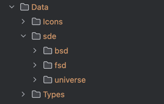

# EVE SDE 数据库构造器

1. 获取官方数据库：https://developers.eveonline.com/resource
2. 解压后放在根目录 `Data/sde` 目录。
3. 从第三方来源获取数据单位信息，如"%","+"等：https://sde.hoboleaks.space/tq/dogmaunits.json 下载后放在 `thirdparty_data_source`
4. 下载 `types` 、 `Icons` 解压到 `Data/Icons` 和 `Data/Types` 目录。
5. 开始构造数据库 `main.py`

# 更新图标

1. 如果需要根据当前已有物品信息来更新图标，则单独执行 `fetchIcons/sync_icon.py`
2. 下载好图标后，执行 `fetchIcons/replace_icon.py` ，使下载的图标与 `Data/Types` 合并
3. 最后重新执行 `main.py` 构造资源包
4. 如果EVE有新增的物品等内容，导致需要**完全重新构造**图标资源包，则删除 `icon_md5_map.txt` 、 `fetchIcons/typeids.txt` 和 `fetchIcons/not_exist.txt`，再重复执行前三步。

# 更新星系信息

1. 执行 `fetchUniverse/fetchUniverse.py`
2. 脚本会自动缓存各id的详情并跳过已有缓存。但星系列表、星域列表、星座列表总是会获取。 
3. 如果要重新联网更新，则删除 `fetchUniverse/cache` 目录并重新执行 1
4. 上述完成后会生成 `universe_data.json`
5. 执行 `main.py` 即可

# 转为 duckDB

DuckDB 比 SQLite 更高效，更精简，如果有需求，可以使用 `sqlite_to_duckdb.py` 进行转换。

# 输出文件

1. 静态数据库: output/db
2. 图标文件压缩包: output/Icons/icons.zip

# 制作app图标

1. 做一个 png 图标，然后在预览中导出，选择png格式，并选择去除alpha通道
2. 访问 https://makeappicon.com/ 制作各种尺寸的图标

# 钱包日志文本本地化：

1. 依次执行：`accounting_entry_types` 目录中的各脚本 (1-3)，会生成 `accounting_entry_types/output/accountingentrytypes_localized.json`
2. 将该 `accounting_entry_types/output/accountingentrytypes_localized.json` 传到 IOS 项目的 `language` 目录即可

# 代理人名称本地化：

1. 依次执行：`accounting_entry_types` 目录中的各脚本 (1-4)，会生成 `accounting_entry_types/output/en_multi_lang_mapping.json`
2. 执行 `main.py` 即可在各语言的sqlite文件的 `agents` 表创建 `agent_name` 列

# 空间站名称本地化：

1. 依次执行：`accounting_entry_types` 目录中的各脚本 (1-4)，会生成 `accounting_entry_types/output/combined_localization.json`
2. 执行 `station_name_localization/station_template_generator.py` 即可生成各空间站的名称的模板。
3. 注意 `accounting_entry_types/static_data/stations_202504102216.json` 文件来自 `stations` 表的导出。
4. 
