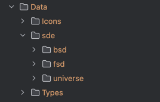

# EVE SDE 数据库构造器

1. 获取官方数据库：https://developers.eveonline.com/resource , https://developers.eveonline.com/docs/services/iec/
2. 解压后放在根目录 `Data/sde` 目录。
3. 从第三方来源获取数据单位信息，如"%","+"等：https://sde.hoboleaks.space/tq/dogmaunits.json 下载后放在 `thirdparty_data_source`。
4. 物品打包体积来自第三方数据来源：https://sde.hoboleaks.space/tq/repackagedvolumes.json ，放在 `thirdparty_data_source/repackagedvolumes.json`
4. 下载 `types` 、 `Icons` 解压到 `Data/Icons` 和 `Data/Types` 目录。 (不怎么更新了)(建议删除 `Data/Types` 目录)
5. 开始构造数据库 `main.py`
6. 加成带来的 dbuff 效果来自 https://github.com/EVEShipFit/sde/releases



# 更新图标

根据需要，执行 `fetchIcons\main.py`

# 更新星系信息

根据需要，执行 `fetchUniverse\main.py`

# 输出文件

1. 静态数据库: output/db
2. 图标文件压缩包: output/Icons/icons.zip

# 制作app图标

1. 做一个 png 图标，然后在预览中导出，选择png格式，并选择去除alpha通道
2. 访问 https://makeappicon.com/ 制作各种尺寸的图标

# 钱包日志文本本地化：

1. 执行 `accounting_entry_types/main.py`
2. 将 `accounting_entry_types/output/accountingentrytypes_localized.json` 传到 IOS 项目的 `language` 目录即可

# 代理人名称本地化：

1. 执行 `accounting_entry_types/main.py` (同上，无需反复执行)
2. 执行 `main.py` 即可在各语言的sqlite文件的 `agents` 表创建 `agent_name` 列

# 空间站名称本地化：

1. 执行 `accounting_entry_types/main.py` (同上，无需反复执行)
2. 执行 `station_name_localization/main.py` 即可生成各空间站的名称的模板。
3. 注意 `accounting_entry_types/static_data/stations_202504102216.json` 文件来自 `stations` 表的导出。
4. 执行 `main.py` 即可在各语言的sqlite文件的 `stations` 表更新 `stationName` 列

# 邻居星系

1. 执行 `main.py` 会在 `output/db` 目录生成文件 `neighbours_data.json` 文件，传入 IOS 项目即可。

# 物品属性

如果需要更新物品属性，有两个来源：
1. 执行 `fetchTypes/fetch_type_dogma.py` (不建议)
2. 从 [https://github.com/EVEShipFit/sde/tree/main](https://github.com/EVEShipFit/sde/tree/main) 下载并替换，同时，设置 main.py 中的 load_online 为 false。

可以替换官方SDE的：

- `typeDogma.yaml`
- `typeMaterials.yaml`
- `dogmaEffects.yaml`
- `marketGroups.yaml`
- `agentsInSpace.yaml`
- `ancestries.yaml`
- `bloodlines.yaml`
- `blueprints.yaml`
- `categories.yaml`
- `contrabandTypes.yaml`
- `controlTowerResources.yaml`
- `corporationActivities.yaml`
- `dogmaAttributeCategories.yaml`
- `groups.yaml`
- `iconIDs.yaml`
- `npcCorporationDivisions.yaml`
- `npcCorporations.yaml`
- `planetSchematics.yaml`
- `researchAgents.yaml`
- `skinLicenses.yaml`
- `skins.yaml`
- `stationOperations.yaml`
- `stationServices.yaml`

有差异，但未缺失重要信息的：

- `dogmaAttributes.yaml`
- `factions.yaml`
- `metaGroups.yaml`
- `races.yaml`

缺失重要信息的：

- `types.yaml` （缺少 traits 字段）

在下载目录执行命令，即可只保留有效数据：

```bash
cd /Users/gg/Downloads/sde
keep_files=(
  "typeDogma.yaml"
  "typeMaterials.yaml"
  "dogmaEffects.yaml"
  "marketGroups.yaml"
  "agentsInSpace.yaml"
  "dbuffCollections.yaml"
  "ancestries.yaml"
  "bloodlines.yaml"
  "blueprints.yaml"
  "categories.yaml"
  "contrabandTypes.yaml"
  "controlTowerResources.yaml"
  "corporationActivities.yaml"
  "dogmaAttributeCategories.yaml"
  "groups.yaml"
  "iconIDs.yaml"
  "npcCorporationDivisions.yaml"
  "npcCorporations.yaml"
  "planetSchematics.yaml"
  "researchAgents.yaml"
  "skinLicenses.yaml"
  "skins.yaml"
  "stationOperations.yaml"
  "stationServices.yaml"
  "dogmaAttributes.yaml"
  "factions.yaml"
  "metaGroups.yaml"
  "races.yaml"
)

for f in *; do
  if [[ ! " ${keep_files[*]} " =~ " $f " ]]; then
    echo "删除文件: "$f""
    rm -f -- "$f"
  fi
done
```

```powershell
# 定义要保留的文件列表
$keep_files = @(
    "typeDogma.yaml",
    "typeMaterials.yaml",
    "dogmaEffects.yaml",
    "marketGroups.yaml",
    "agentsInSpace.yaml",
    "ancestries.yaml",
    "bloodlines.yaml",
    "blueprints.yaml",
    "categories.yaml",
    "contrabandTypes.yaml",
    "dbuffCollections.yaml",
    "controlTowerResources.yaml",
    "corporationActivities.yaml",
    "dogmaAttributeCategories.yaml",
    "groups.yaml",
    "iconIDs.yaml",
    "npcCorporationDivisions.yaml",
    "npcCorporations.yaml",
    "planetSchematics.yaml",
    "researchAgents.yaml",
    "skinLicenses.yaml",
    "skins.yaml",
    "stationOperations.yaml",
    "stationServices.yaml",
    "dogmaAttributes.yaml",
    "factions.yaml",
    "metaGroups.yaml",
    "races.yaml"
)

# 获取当前目录下的所有文件
Get-ChildItem -File | ForEach-Object {
    # 如果文件不在保留列表中，则删除
    if ($_.Name -notin $keep_files) {
        Remove-Item -Path $_.FullName -Force
        Write-Host "已删除文件: $($_.Name)"
    } else {
        Write-Host "保留文件: $($_.Name)"
    }
}
```

# 物品效果

效果的 effect_category 是该效果的类型，可以判断主动、被动等装备。目录id分类见 `https://sde.hoboleaks.space/tq/dogmaeffectcategories.json`

# 比较新旧数据库

```commandline
C:\Windows\System32\sqldiff.exe --summary old.sqlite new.sqlite

sqldiff --summary old.sqlite new.sqlite
```

# 游戏内图标

所有 EVE 文件都在 EVE\SharedCache\ResFiles 文件夹中。

EVE\SharedCache\tq\resfileindex.txt 包含文件列表和路径。

例如，这行：

res:/ui/texture/windowicons/abyssalfilament.png,1f/1f023a06d843f226_aea8910fa75ef1985037875159d7311c,aea8910fa75ef1985037875159d7311c,1825,1898

告诉我 abyssalfilament.png 图标在 "1f" 文件夹中，名称是：

"1f023a06d843f226_aea8910fa75ef1985037875159d7311c"

所以只需复制它并将其重命名为 .png